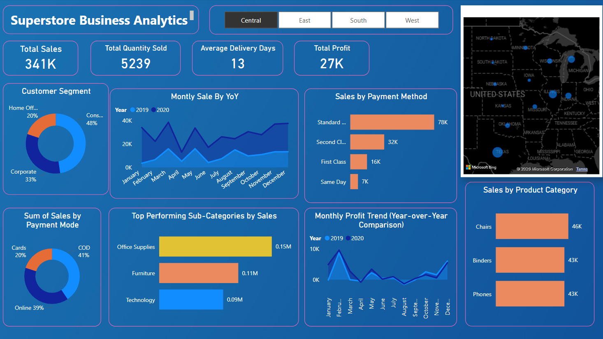

# 📊 Superstore Sales Dashboard (Power BI)

## 📌 Project Overview
This project presents an interactive Superstore Sales Dashboard built using Power BI to analyze sales performance, profit trends, and regional insights.

---

## 🚀 Key Features
- Total Sales, Profit & Quantity KPIs
- Sales by Region Analysis
- Profit by Category
- Sales by Customer Segment
- Year-wise Sales Trend
- Interactive Filters & Slicers

---

## 🛠 Tools & Technologies Used
- Power BI
- Microsoft Excel
- Data Cleaning
- DAX (Data Analysis Expressions)

---

## 📁 Project Files
- Superstore Sales Dashboard (.pbix)
- Superstore Dataset (.xlsx)
- Dashboard Preview Image

---

## 📷 Dashboard Preview

---

## 📊 Insights Generated
- West region generated the highest sales.
- Technology category produced the highest profit.
- Consumer segment contributed the most revenue.

---

## 👤 Author
Nitesh Jolla  
Data Analyst | Power BI Developer
